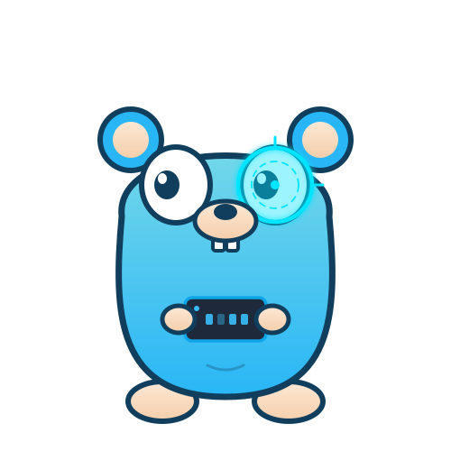

# Learning Go

Hi , Arkaneel this side and i am learning go my own way a non standard approach where i deal with systems and only using mostly the standard library before using any sort of external packages , i am trying to understand the language better and trying to remove abstraction layers , and slowly diving deeper into systems . Ofcourse slowly i will use packages too for the industry standard development but this is own way to understand the language and the compiter better

